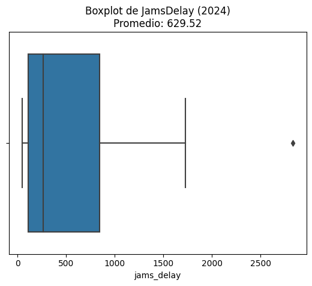
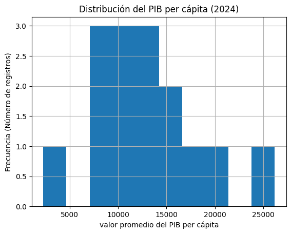
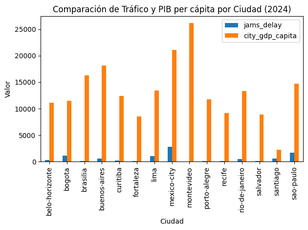
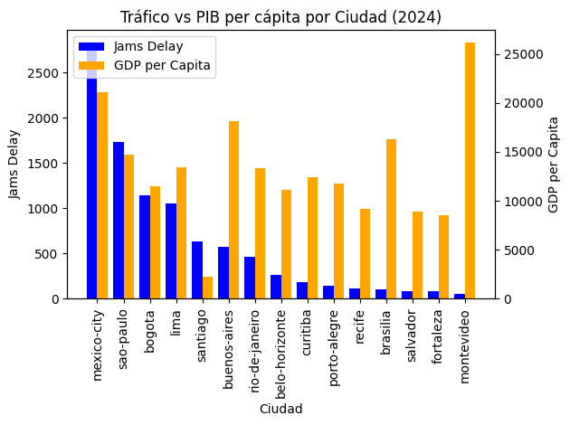

# Movilidad Urbana y Productividad Económica — LATAM

Análisis que combina datos reales de tráfico (TomTom Traffic Index) con indicadores económicos urbanos (OECD Cities) para evaluar la relación entre congestión vehicular y productividad económica en ciudades de América Latina durante 2024.

## Contexto

Como analista de un banco de desarrollo, el objetivo fue identificar en qué ciudades tendría más impacto invertir en infraestructura de transporte, cruzando niveles de congestión (retrasos, tiempos de viaje) con PIB per cápita y desempleo.

**Fuentes de datos**:
- `tomtom_traffic.csv` — más de 1M de registros de tráfico en tiempo real (retraso, índice de tráfico, longitud de embotellamientos) por ciudad
- `oecd_city_economy.csv` — indicadores económicos anuales por ciudad (PIB per cápita, desempleo, PM2.5, población)

## Preguntas clave

- ¿Qué ciudades presentan alta congestión y baja productividad económica?
- ¿Cuáles muestran los mejores indicadores combinados (movilidad eficiente y economía fuerte)?
- ¿Qué variables parecen tener una relación más fuerte con el desarrollo urbano?

## Metodología

1. Carga y exploración de ambas fuentes (1,004,464 registros de tráfico; 30 registros de economía)
2. Estandarización de nombres de columnas y tipos de datos (fechas, separadores numéricos)
3. Extracción del año y filtrado al periodo más reciente y relevante: **2024**
4. Cálculo de promedios de tráfico agregados por ciudad, país y año
5. Unión (`INNER JOIN`) de tráfico y economía por ciudad–año, asegurando información completa en ambos indicadores
6. Visualización con boxplots, histogramas y gráficos de barras comparativos (incluyendo un gráfico de doble eje para contrastar tráfico y PIB por ciudad)
7. Exportación del dataset final limpio y unificado (`ladb_mobility_economy_2024_clean.csv`)

## Resultados y recomendaciones

- **La Ciudad de México** tiene el mayor tiempo promedio de tráfico entre las ciudades analizadas
- No existe una relación lineal clara entre congestión vehicular y PIB per cápita:
  - **Montevideo** — PIB alto, congestión muy baja
  - **Santiago** — PIB relativamente bajo, congestión moderada
  - **Ciudad de México** — alta congestión, pero no el PIB más alto
  - **São Paulo** — alta congestión con PIB medio-alto
- **Bogotá** combina congestión relativamente alta con un PIB per cápita moderado-bajo frente a ciudades como Santiago o Montevideo, lo que sugiere presión estructural en su infraestructura urbana
- **Recomendación**: Bogotá emerge como ciudad prioritaria para evaluar inversión en infraestructura de transporte. Se recomienda complementar el análisis con densidad poblacional, crecimiento urbano, calidad del transporte público, y un análisis de correlación estadística formal para validar los patrones observados

## Visualizaciones

| | |
|---|---|
|  |  |
|  |  |

## Herramientas

Python (pandas, numpy, seaborn, matplotlib) en Jupyter Notebook.

## Estructura del repo

```
latam-urban-mobility-productivity/
├── Movilidad_Urbana_Productividad_LATAM.ipynb
├── ladb_mobility_economy_2024_clean.csv
├── images/
└── README.md
```
